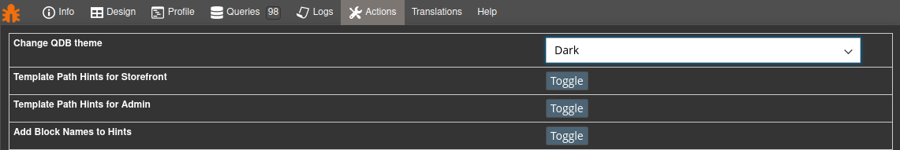
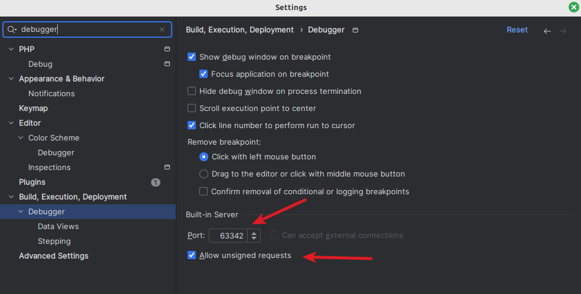

Developer Toolbar for Magento2
====================================

[](https://codeclimate.com/github/vpietri/magento2-developer-quickdevbar)
[](https://packagist.org/packages/vpietri/adm-quickdevbar)


:gift: Currently, the `ADM_QuickDevBar` module has been refactored heavily: The architecture is redesigned to be compatible with Full page cache and fit coding standard :sparkles: 
New functionalities are plugged: VarDumper handler, SQL backtrace, and more see [Changelog](doc/Changelog.md) . 
The refactoring has come available under a new major version 0.2.0. 

# Requirement

Supported versions: Magento 2.4.x till 2.4.6 but should work with lower version.
See composer.json for other requirements.

# About

Hope this debug toolbar can speed up Magento2 development module. Any feedback and idea to improve this toolbar will be appreciated :beers: so get in touch via the [issue tracker on GitHub](https://github.com/vpietri/magento2-developer-quickdevbar/issues). Feel free to fork and pull request.
The structure of this toolbar is extremely simple you just need to add a new block in the layout to get your tab running.

## Panels

- Info : Main informations about controller, route, action and store. Search on core config data. Dedicated tab output for local and global phpinfo.
- Design : List handles called and display layout structure of nested blocks and containers
- Profile : View current observers, all events dispatched, collections and models loaded, plugins instanciated, preferences, cache hits
- Queries :  Statistics about executed queries and detailed query listing with syntax highlighting of main SQL keywords
- Logs : Display log files with ability to reset these files
- Dump : Catch all dump() in code
- Actions : Easily toggle template hints and inline translation and flush cache
- Translation : Quickly see module, pack,theme and	DB translations
- Help : Show module version and link to github

## Screenshots

- Info tab


- Queries Tab


- Theme chooser


# Installation

## Manual (without composer)

- Download zip file of the last version of this extension under release tab
- Extract files in the Magento root directory in the folder app/code/ADM/QuickDevBar
- Enable the extension
```
php bin/magento --clear-static-content module:enable ADM_QuickDevBar
```
- Upgrade Magento setup
```
php bin/magento setup:upgrade
```

## With Composer

In the Magento root directory

- Install the module
```
composer require vpietri/adm-quickdevbar --dev
php bin/magento module:enable ADM_QuickDevBar 
php bin/magento setup:upgrade
```

## With Modman

In the Magento root directory

- Install the module
```
modman clone git@github.com:vpietri/magento2-developer-quickdevbar.git
php bin/magento module:enable ADM_QuickDevBar 
php bin/magento setup:upgrade
```

## Cleaning

- Upgrade Magento setup
```
php bin/magento setup:upgrade
```

- Clear cache
```
php bin/magento cache:flush
```

## Setup

The toolbar is displayed by default if your web server is on your local development environment.

You can force activation via command line
```
php bin/magento dev:quickdevbar:enable
```
and activate full sql backtrace 
```
php bin/magento dev:quickdevbar:enable --sql-qdb-profiler
```

Or via the standard configuration in the Advanced/Developer/Quick dev bar section.

If you do not see the toolbar you should either force activation by filling your IP in the field "Allowed IPs" and fill a matching pattern of you user-agent in the field "Allowed user-agent pattern" if it's needed.


### URI File to IDE 

(Beta) In PhpStorm you can use **IDE Remote Control** to open file

https://plugins.jetbrains.com/plugin/19991-ide-remote-control



# Sponsors

[](https://www.sansec.io/)  

Add your logo on <a href="https://github.com/sponsors/vpietri" rel="me" class="link">Github Sponsors</a>

# Documentation

- [Changelog](doc/Changelog.md)
- ~~You can extend this toolbar with your own tabs, a [sample module](https://github.com/vpietri/magento2-brandnew_quikdevsample) is available.~~ (refactoring coming soon)

