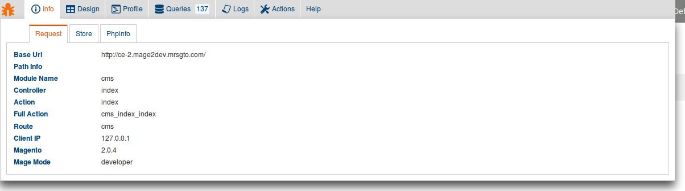
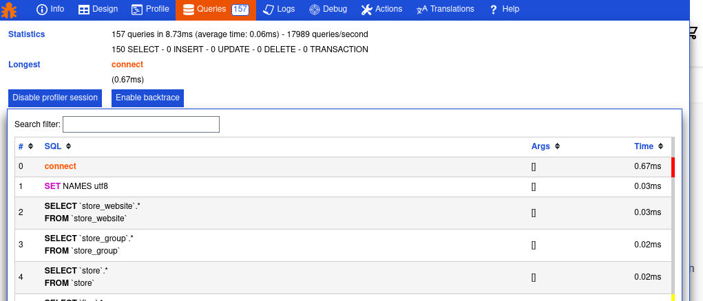
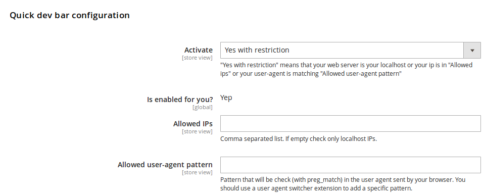
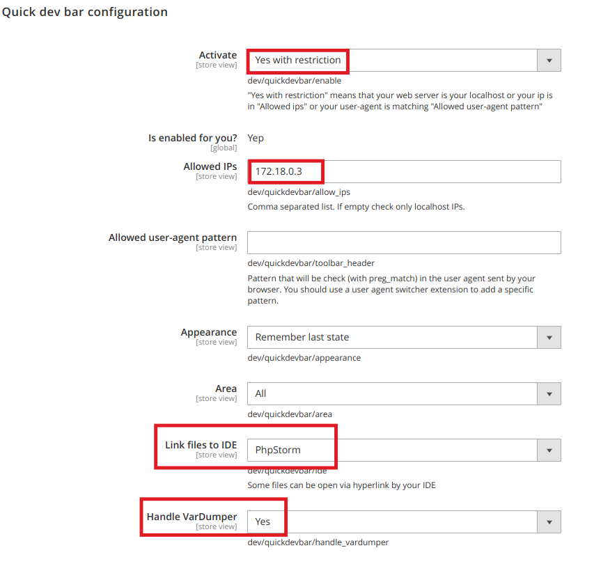

Developer Toolbar for Magento2
====================================

[](https://codeclimate.com/github/vpietri/magento2-developer-quickdevbar)
[](https://packagist.org/packages/vpietri/adm-quickdevbar)


# About

Hope this debug toolbar can speed up Magento2 development module. Any feedback and idea to improve this toolbar will be appreciated so get in touch via the [issue tracker on GitHub](https://github.com/vpietri/magento2-developer-quickdevbar/issues). Feel free to fork and pull request.
The structure of this toolbar is extremely simple you just need to add a new block in the layout to get your tab running.

# Features

## Panels

- Info : Main informations about controller, route, action and store. Search on core config data. Dedicated tab output for local and global phpinfo.
- Design : List handles called and display layout structure of nested blocks and containers
- Profile : View current observers, all events dispatched, collections and models loaded, plugins instanciated
- Queries :  Statistics about executed queries and detailed query listing with syntax highlighting of main SQL keywords
- Logs : Display log files with ability to reset these files
- Translation : Quickly see module, pack,theme and	DB translations
- Actions : Easily toggle template hints and inline translation and flush cache
- Help : Show module version and link to github

## Screenshots

- Info tab


- Queries Tab


- See the toolbar in action
[](https://www.youtube.com/watch?v=7p2Y_dqBfCM)

# Installation

## Manual (without composer)

- Download zip file of thelast version of this extension under release tab
- Extract files in the Magento root directory in the folder app/code/ADM/QuickDevBar
- Enable the extension
```
php bin/magento --clear-static-content module:enable ADM_QuickDevBar
```
- Upgrade Magento setup
```
php bin/magento setup:upgrade
```

## With Composer

In the Magento root directory

- Install the module
```
composer require vpietri/adm-quickdevbar
php bin/magento module:enable ADM_QuickDevBar 
php bin/magento setup:upgrade
```

## With Modman

In the Magento root directory

- Install the module
```
modman clone git@github.com:vpietri/magento2-developer-quickdevbar.git
php bin/magento module:enable ADM_QuickDevBar 
php bin/magento setup:upgrade
```

## Cleaning

- Upgrade Magento setup
```
php bin/magento setup:upgrade
```

- Clear cache
```
php bin/magento cache:flush
```

## Setup

The toolbar is displayed by default if your web server is on your local development environment.

The configuration is in  Stores/Configuration/Advanced/Developer/Quick dev bar configuration


If you do not see the toolbar you should either force activation by setting the select "Activate" to "Yes" or fill your IP in the field "Allowed IPs" or fill a matching pattern of you user-agent in the field "Allowed user-agent pattern" 


# Documentation

- [Changelog](doc/Changelog.md)
- You can extend this toolbar with your own tabs, a [sample module](https://github.com/vpietri/magento2-brandnew_quikdevsample) is available.
