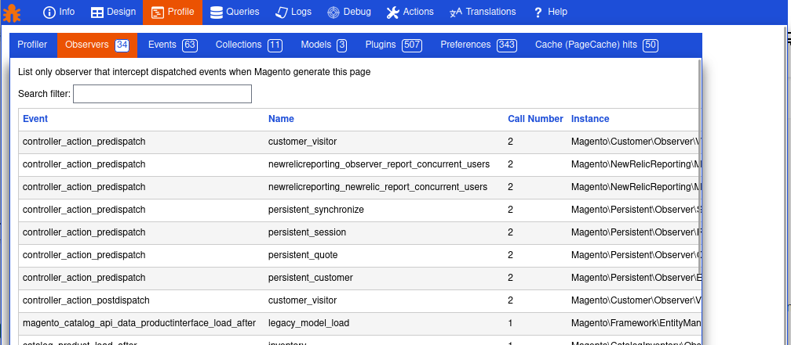

Developer Toolbar for Magento2
====================================

# About

This is an handmade toolbar by a developer for developers. As it is my first extension on Magento 2 I would appreciate any feedback and idea to improve this toolbar so get in touch via the [issue tracker on GitHub](https://github.com/vpietri/magento2-developer-quickdevbar/issues). 
Feel free to fork and pull request. Structure of this toolbar is extremly simple you just need to add a new block in the layout to get your tab running. 

# Screenshots

Info tab


Queries Tab


Dispatch Tab



# Requirements

- Magento Composer Installer: To copy the module contents under app/code/ folder.
In order to install it run the below command on the root directory:
```
composer require magento/magento-composer-installer
```

- Add the VCS repository: So that composer can find the module. Add the following lines in your composer.json

        "repositories": [
        {
            "type": "vcs",
            "url": "https://github.com/vpietri/magento2-developer-quickdevbar"
        }],


# Installation

- Install the module with composer
```
composer require vpietri/adm-quickdevbar
```

- Update Magento setup
```
php bin/magento setup:upgrade
```

- Update Magento data version
```
php bin/magento setup:db-data:upgrade
```

- Clear cache
```
php bin/magento cache:flush
```

# Coming soon

* Back office toolbar
* New actions: Rebuit index, Search config...

# Changelog

0.1.4
* Fix bug on composer.json with registration.php
* Clean layout display

0.1.3
* Compatibility with Magento 2.0.0 Publication
* Add action tab (Template hints, Translate inline, Flush Cache Storage)
* Controller structure cleaning 

0.1.2
* Add sub-tab and reorganize existing tabs

0.1.1
* Javascript cleaning to meet coding standards
* Add [sunnywalker/filterTable](https://github.com/sunnywalker/jQuery.FilterTable)
* Fix bugs on the log screen
* Css improvements

0.0.1
*  module initialization 
